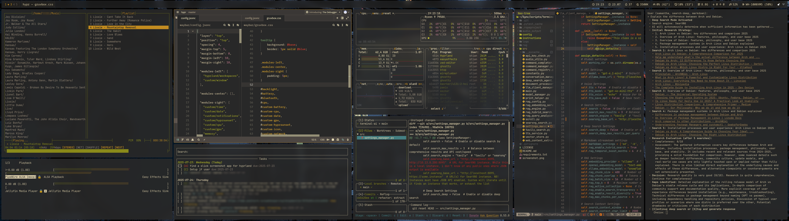

# Hyprland Configuration



A clean Hyprland setup with Waybar, notification center, and essential Wayland tools. Also, easy to swap themes with the `theme` variable in `hyprland.conf`. Only gruvbox is included here, but if you look at the gruvbox theme, you can easily understand how to add more themes.

## Required Packages

Install these packages to get the configuration running:

```bash
# Core Hyprland & Session
yay -S hyprland hyprpaper swaylock-effects swayidle

# Panels and notifications
yay -S waybar swaync libnotify

# xdg/Portal/Policy
yay -S xdg-desktop-portal-hyprland polkit-gnome

# Clipboard and tools
yay -S wl-clipboard cliphist

# Screenshots
yay -S grim slurp swappy

# Audio/Media
yay -S wireplumber pavucontrol playerctl

# Display and utilities
yay -S hyprsunset brightnessctl wlr-randr wtype

# Network and bluetooth
yay -S network-manager-applet blueman wireless_tools

# Desktop and UI layers
yay -S gtk4-layer-shell qt5-wayland qt6-wayland qt5ct

# Application Launcher
yay -S walker-bin libqalculate 

# Fonts
yay -S ttf-nerd-fonts-symbols-mono

# Overkill Nerd Fonts
git clone https://github.com/ryanoasis/nerd-fonts.git
cd nerd-fonts
chmod +x install.sh
bash install.sh
```

## Usage

After installing the packages, copy this configuration to `~/.config/hypr/` and start Hyprland.

Applications (terminal, browser, editor, etc.) are configurable via variables in `hyprland.conf`.

## FAQ

### What programs are showcased in the screenshot?
- [TodoTxtTui](https://github.com/mdillondc/todo_txt_tui)
- [Terminal AI Assistant](https://github.com/mdillondc/terminal-ai)